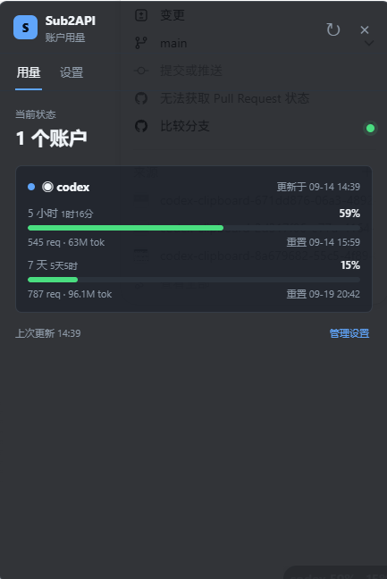

# Sub2API 账户用量

Windows 11 系统托盘中的 Sub2API 管理员账户用量监控工具。

## 功能

- 使用官方图标常驻系统托盘，悬停可查看当前账户用量。
- 单击托盘图标打开详细用量面板，点击其他区域或关闭按钮即可隐藏。
- 显示所有账户的 5 小时和 7 天已用比例。
- 点击账户名称查看最近 30 天的请求数和 Token 使用趋势。
- 支持 Admin API Key、邮箱密码、TOTP 两步验证和 JWT 自动刷新。
- 支持多个账户，并在托盘提示和悬浮条中自动切换显示。

## 半透明悬浮条

- 可在设置中开启或关闭。
- 固定为 90 × 30 像素，显示账户厂家图标、5 小时已用比例和 7 天已用比例。
- 使用 LobeHub Icons 提供的黑白厂家图标，无法识别厂家时显示 OpenAI 图标。
- 默认背景完全透明，鼠标悬浮时显示 50% 半透明背景。
- 自动检测悬浮条附近的背景亮度，在黑色和白色图标文字之间切换。
- 多账户时整行上下滚动切换。
- 可以拖动到屏幕任意边缘，松开后自动吸附。
- 会记住上次位置，下一次启动时自动恢复。
- 可通过托盘右键菜单设置是否置顶。
- 检测到远程桌面、浏览器、游戏、视频或 PPT 全屏时自动隐藏，退出全屏后恢复。

## 使用方法

首次打开后，在“设置”中填写：

- Sub2API 服务根地址，例如 `https://sub2api.example.com`，不要追加 `/api/v1`。
- Admin API Key，或管理员邮箱和密码。
- 可选的 TOTP 两步验证码。

托盘右键菜单可以打开设置、切换悬浮条置顶状态或退出程序。

## 刷新设置

- 默认每 300 秒自动刷新，最短可设置为 30 秒。
- 账户切换间隔默认 5 秒。
- 如果刷新时间到达时电脑已连续空闲至少一个刷新周期，则跳过本次刷新；手动刷新不受影响。

## 自动更新

- 默认从 `https://github.com/tsiens/sub2api-account-usage` 检查新版本。
- 可以在设置中替换为其他 GitHub 仓库地址、`ghproxy` 前缀地址（例如 `https://ghproxy.net/https://github.com/owner/repo`），或包含 `latest.yml` 的更新地址。
- 托盘图标右键菜单提供“检查更新”，可随时手动检查新版本。
- 程序启动时和运行期间会自动检查更新。
- 发现新版本后自动下载，下载完成后可选择立即重启安装或稍后安装。

## 数据安全

- 登录凭据保存在 Windows 系统保护的安全存储中。
- 管理员密码不会以明文保存。
- 配置和日志保存在 Windows 用户数据目录的 `sub2api-account-usage` 文件夹中。

## 许可证

MIT
