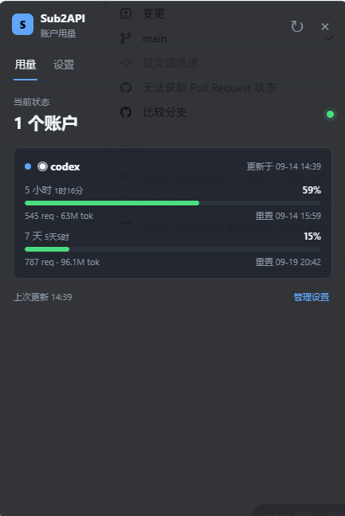

# Sub2API 账户用量

Windows 10/11 系统托盘中的 Sub2API 账户用量监控工具，同时面向管理员和普通用户。

## 功能

- 使用官方图标常驻系统托盘，悬停可查看当前账户或订阅用量。
- 单击托盘图标打开详细用量面板，点击其他区域或关闭按钮即可隐藏。
- 登录时自动识别身份：管理员查看所有账户的近 5 小时和 7 天已用比例；普通用户查看自己的订阅本周和本月已用比例。
- 多账户或多订阅时自动切换，并在托盘提示和悬浮条中一并轮转显示。
- 点击账户数量打开对应后台页面：管理员打开 `/admin/dashboard`，普通用户打开 `/dashboard`。
- 支持邮箱密码登录、TOTP 两步验证和 JWT 自动刷新。

## 半透明悬浮条

- 可在开启或关闭置顶。
- 管理员按“5 小时已用比例、厂家图标、7 天已用比例”显示；普通用户按“本周已用比例、厂家图标、本月已用比例”显示。
- 使用 LobeHub Icons 提供的黑白厂家图标，无法识别厂家时显示 OpenAI 图标。
- 默认背景完全透明，鼠标悬浮时显示 50% 半透明背景。
- 自动检测悬浮条附近的背景亮度，在黑色和白色图标文字之间切换。
- 多账户时整行上下滚动切换。
- 可以拖动到屏幕任意边缘，松开后自动吸附。
- 会记住上次位置，下一次启动时自动恢复。
- 可通过托盘右键菜单设置是否置顶。
- 检测到远程桌面、浏览器、游戏、视频或 PPT 全屏时自动隐藏，退出全屏后恢复。

## 使用方法

首次打开后，在“设置”中填写：

- Sub2API 服务根地址，例如 `https://sub2api.example.com`，不要追加 `/api/v1`。
- 使用你的 Sub2API 邮箱和密码登录，可选 TOTP 两步验证码。

托盘右键菜单可以打开设置、切换悬浮条置顶状态或退出程序。

## Codex 配置与模型管理

在“Codex”页面为 Codex CLI 生成连接配置并管理可用模型：

- 填写 API Key 后点击保存，会自动把连接信息和模型清单路径写入 `~/.codex/config.toml`，并保留原有内容，无需手工编辑。
- 模型清单由随程序携带的 `models.json` 统一管理，按供应商分组（如 Codex、DeepSeek）勾选需要启用的模型，保存后生成 `~/.codex/models.json`。
- 带网络来源（source）的供应商会在启动和检查更新时自动拉取最新的模型列表，GitHub 无法直接访问时自动改用代理重试；无法匹配到供应商的旧模型会归入“无法溯源”分组，便于保留或取消。
- 每次保存内容有变化时，自动在安装目录 `provider/codex/backups` 下生成备份，可按时间倒序浏览，支持打开预览、还原或删除。

## 刷新设置

- 默认每 300 秒自动刷新，最短可设置为 30 秒。
- 账户切换间隔默认 5 秒。
- 如果刷新时间到达时电脑已连续空闲至少一个刷新周期，则跳过本次刷新；手动刷新不受影响。

## 自动更新

- 自动从内置地址 `https://github.com/tsiens/sub2api-account-usage` 检查新版本，无需配置更新地址。
- 检查版本或下载新包直连 GitHub 失败时，会自动改用 `https://gh-proxy.org/` 前缀代理重试。
- 远程更新必须使用 HTTPS（本机测试地址除外），并提供与安装包同名的 `.sha256` 摘要文件；校验失败时不会运行安装程序。
- 托盘图标右键菜单提供“检查更新”，可随时手动检查新版本。
- 程序启动时和运行期间会自动检查更新。
- 发现新版本后自动下载，下载完成后可选择立即重启安装或稍后安装。

## 数据安全

- 登录凭据使用 Windows DPAPI 加密后保存在当前用户配置中，密码不会以明文保存。
- 更换 Sub2API 服务器后会自动清除原服务器鉴权，避免把旧凭据发送到新服务器。
- 配置和日志保存在安装目录中。
- 配置写入使用原子替换并保留备份；日志达到 2 MB 后自动轮转。

## 许可证

MIT
